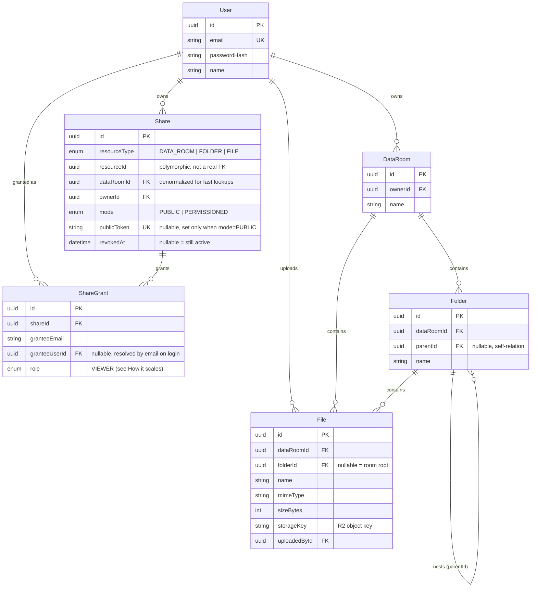

# Data Room — API

A Fastify + PostgreSQL backend for a virtual data room: nested folders, direct-to-storage
file uploads, and read-only sharing via public links or permissioned invites, built for M&A
due diligence–style document workflows.

This is the **API**. It talks to the browser over REST and to
[`data-room`](https://github.com/mejzerVitaliy/data-room) (the Next.js frontend) over CORS;
there's no server-rendered UI here.

## 🛠️ Technology Stack

- [TypeScript](https://www.typescriptlang.org/) - programming language
- [Node.js](https://nodejs.org/en) - JavaScript runtime
- [Fastify](https://fastify.dev/docs/latest/Guides/Getting-Started/) - HTTP framework
- [Zod](https://zod.dev) - validation
- [Swagger](https://swagger.io/) - API documentation
- [Awilix](https://github.com/jeffijoe/awilix) - Dependency Injection container
- [PostgreSQL](https://www.postgresql.org/) - relational database
- [Prisma](https://www.prisma.io/docs/getting-started) - database ORM
- [@fastify/jwt](https://github.com/fastify/fastify-jwt) + [argon2](https://github.com/ranisalt/node-argon2) - auth (JWTs in httpOnly cookies, hashed passwords)
- [@fastify/rate-limit](https://github.com/fastify/fastify-rate-limit) - abuse protection, stricter on auth routes
- [AWS SDK v3 S3 client](https://github.com/aws/aws-sdk-js-v3) against **Cloudflare R2** (S3-compatible) - file storage
- [Vitest](https://vitest.dev/) + [Testcontainers](https://testcontainers.com/) - testing

## 🗄️ Data model

Six tables. `Share`/`ShareGrant` are deliberately generic over resource type rather than one
join table per shareable entity — see [How it scales](#-how-it-scales) for why that matters.



All primary/foreign keys are Postgres `uuid` (`gen_random_uuid()`), not sequential ints —
IDs are never enumerable, and object-storage keys can be derived from them without leaking
row counts. `Folder`/`File` uniqueness is enforced in the database, not just the app layer:
`@@unique([dataRoomId, parentId, name])` and `@@unique([dataRoomId, folderId, name])` mean a
duplicate-name race between two concurrent requests fails as a clean constraint violation
(mapped to a 409) instead of silently creating two rows with the same name. `Folder.parentId`
and `File.folderId`/`File.dataRoomId` all cascade on delete, so removing a folder or a data
room removes its whole subtree at the database level — the app layer still walks the subtree
first (see below) purely to report *what* was deleted and to clean up the matching R2 objects,
which Postgres cascades know nothing about.

## 📐 Design decisions

- **Layered architecture**: `Routes → Handlers → Services → Repositories → Database`. Prisma
  calls exist only inside `src/database/repositories/**`; everything above talks to a
  repository's typed interface, never `prisma.*` directly. This is what makes the recursive
  SQL below (folder subtree stats, breadcrumbs, descendant lookups) a repository-local
  implementation detail rather than something leaking into service/handler code.
- **Awilix DI container**: every handler, service, and repository is a factory function
  resolved from the container (`src/plugins/awilix.ts`), never constructed with `new` or
  imported directly. Swapping the storage backend or mocking a service in a test is a
  container override, not a code change.
- **Auth = short-lived access + longer-lived refresh JWT, both httpOnly cookies.** Nothing
  token-shaped is ever readable from JavaScript on the frontend (no `localStorage`, no
  non-httpOnly cookie), which closes off the most common XSS-to-session-theft path. The
  access token (15 min) is scoped to `/`; the refresh token (30 days) is scoped to
  `/api/auth/refresh` only, so it never rides along on ordinary API calls and has a much
  smaller exposure window. In production both cookies are `Secure; SameSite=None` (the
  frontend and API are different origins); set and clear paths use the exact same cookie
  option builder (`auth.util.ts`) so a cross-site cookie *clear* can't silently be dropped by
  the browser for missing the attributes the original *set* had.
- **Direct-to-storage uploads.** The API never proxies file bytes: a client requests a
  presigned R2 PUT URL, uploads straight to Cloudflare R2, then confirms completion. This is
  what gives genuine per-file upload progress on the frontend and keeps large files off the
  API process entirely. Reads work the same way (presigned GET), with `Content-Disposition`
  forced to `attachment` server-side for any MIME type not on an explicit
  preview-safe allowlist — an upload isn't allowed to be an arbitrary MIME type in the first
  place (see Security below), but the disposition fallback is a second, independent layer.
- **Validation is Zod end-to-end.** Every body/query/param schema lives in
  `src/lib/validation/**`; response types are inferred from the same schemas via
  `z.infer`, so the Swagger docs, the runtime validation, and the TypeScript types can't drift
  from each other.
- **Resource ownership/access is resolved once per request, not scattered.** Every
  service that touches a folder/file/share first asserts either direct ownership (walking up
  to the owning `DataRoom`) or an active share grant, and returns a `404` (not a `403`) on
  failure — so a non-owner can't distinguish "doesn't exist" from "exists but isn't yours,"
  and a share that gets revoked while someone is mid-browse fails the same way a moment later.

## 📈 How it scales

### How is a folder's total size and item count computed, including its whole subtree?

A recursive CTE, run on read (`folder.repository.ts#getSubtreeStats`):

```sql
WITH RECURSIVE subtree AS (
    SELECT id FROM folders WHERE id = $1
    UNION ALL
    SELECT f.id FROM folders f INNER JOIN subtree s ON f.parent_id = s.id
)
SELECT
    (SELECT COUNT(*) FROM subtree) - 1 AS folder_count,
    (SELECT COUNT(*) FROM files WHERE folder_id IN (SELECT id FROM subtree)) AS file_count,
    (SELECT COALESCE(SUM(size_bytes), 0) FROM files WHERE folder_id IN (SELECT id FROM subtree)) AS total_size_bytes
```

This is what powers the delete-confirmation preview ("this will remove 12 folders, 43 files,
2.1 GB"). It's correct and simple, and at the depth/fan-out a due-diligence data room
actually has, it's fast — but it is an O(subtree size) walk on every call. The scale-up path,
if a room's folder tree got deep and this were called often (e.g. showing live sizes next to
every folder in a listing, not just on delete), is to stop computing it on read and instead
maintain running `totalSize`/`itemCount` columns on `Folder`, updated incrementally in the
same transaction as any upload/delete/move by walking up the (much shorter) ancestor chain
instead of down the whole subtree. That trades a rare expensive read for a small amount of
extra write work on every mutation — the right trade once reads outnumber writes by a lot,
which is the common case for a folder tree.

### What changes if one data room holds 100,000 files?

Three things, in order of how soon they'd bite:

1. **Pagination.** Every list endpoint already paginates (`getPaginationSkipTake`) and never
   returns an unbounded array — but it's offset (`skip`/`take`) pagination today, which is
   fine at MVP scale and degrades on a large offset (Postgres still has to walk and discard
   every skipped row). At 100k rows, deep pages (page 500+) would move to keyset/cursor
   pagination ordered by `(createdAt, id)` — `WHERE (created_at, id) > (?, ?) ORDER BY
   created_at, id LIMIT ?` — which costs the same regardless of how far into the list you are.
2. **Indexes.** `Folder` and `File` already carry composite indexes on
   `(dataRoomId, parentId)` / `(dataRoomId, folderId)` — the exact shape every "list this
   folder's contents" query filters on — plus the `@@unique` constraints double as indexes for
   conflict checks. At 100k+ files, the filename `search` (currently `ILIKE`) would need a
   trigram index (`pg_trgm` + `GIN`) to stay fast, since a plain B-tree index can't accelerate
   a leading-wildcard `LIKE`.
3. **Ancestor/share resolution.** Checking "is this file under a folder that's been shared"
   walks up `parentId` one row at a time today — fine for a handful of levels, but O(depth)
   per check. At real scale this moves to a materialized path (Postgres `ltree`, or a stored
   `path` array/string per folder maintained on write) so that check becomes a single indexed
   lookup instead of a chain of queries.

### How would sharing extend to per-user roles (viewer/editor) without remodeling?

It mostly wouldn't need to. `ShareGrant.role` is already a real enum column
(`ShareGranteeRole`), not a boolean or an implicit "if you're in this table, you're a
viewer" — it just has one member (`VIEWER`) today because the MVP only needs read access.
Adding `EDITOR` is a single migration adding an enum value, plus a new authorization check
(e.g. `assertGranteeRole(share, ["OWNER", "EDITOR"])`) gating the write endpoints — which
today only ever check `ownerId`, so they already have exactly one place each to add "or has
an active EDITOR grant." No new table, no schema remodel, because the shape was chosen with
this extension in mind: `Share` already separates *who owns the shareable link* from
`ShareGrant`'s *who it's granted to and at what level*.

## 📖 REST API documentation

Swagger/OpenAPI docs are generated automatically from the same Zod route schemas used for
runtime validation — nothing is hand-written or able to drift from the real request/response
shape. Locally: `http://localhost:3001/documentation` once the server is running (password
via `DOCS_PASSWORD` if set).

## 📌 Getting started

### 🚀 Local development (Docker)

1. `npm install` - install dependencies locally (needed for editor tooling; the app itself
   runs in Docker)
2. Copy `.env.example` to `.env` and fill in real values (see table below)
3. `docker compose up` - starts the API and a local Postgres container

### ⚙️ Environment variables

| Variable | Required | Description |
| --- | --- | --- |
| `DATABASE_URL` | yes | Postgres connection string. Inside Docker Compose, host is `postgresdb`; from the host machine (e.g. to run migrations), swap it to `localhost`. |
| `NODE_ENV` | yes | `development` / `production` / `test`. Also controls cookie `secure`/`sameSite` behavior — see [Design decisions](#-design-decisions). |
| `APPLICATION_SECRET` | yes | JWT signing secret. |
| `APPLICATION_URL` | yes | The API's own base URL. |
| `FRONTEND_URL` | yes | The deployed frontend's origin — used for CORS. |
| `PORT` | yes | Port the server listens on. |
| `DOCS_PASSWORD` | no | Basic-auth password protecting `/documentation` in production. |
| `AWS_REGION` | yes | `auto` for Cloudflare R2. |
| `AWS_ACCESS_KEY_ID` / `AWS_SECRET_ACCESS_KEY` | yes | R2 API token credentials. |
| `AWS_S3_BUCKET_NAME` | yes | R2 bucket name. |
| `AWS_S3_ENDPOINT` | yes | R2's S3-compatible endpoint for the bucket's account. |

### ⚙️ Running Prisma migrations

Since both the Node.js server and PostgreSQL run inside Docker containers, the database
connection normally uses the [Docker Compose network](https://docs.docker.com/compose/networking/) —
inside the Node.js container, the DB host is `postgresdb`.

To create/run a migration from the host machine:
1. `docker compose up` (containers running)
2. In `.env`, temporarily change `DATABASE_URL`'s host from `postgresdb` to `localhost`
3. `npm run prisma:migrate:create` - generates the SQL migration file (review it before applying)
4. `npm run prisma:migrate:apply` - applies it
5. Revert `DATABASE_URL` back to `postgresdb` so the containerized app can still connect

In production, migrations run via `npm run prisma:deploy` (`prisma migrate deploy`) against
the real `DATABASE_URL`, with no dev-mode prompts.

### 🧪 Running tests

#### Unit tests
- `npm run test:unit` - all unit tests
- `npm run test:unit:ui` - interactive UI runner

#### Integration tests
`npm run test:int` - a throwaway Postgres container is started automatically via
Testcontainers and migrated once per run; each test starts from a truncated database, and
each Vitest worker gets its own database so files still run in parallel. The only
prerequisite is a running Docker daemon.

Only if a test needs the storage emulator (LocalStack S3): `docker compose -f docker-compose.test.yml up`.

## 🔒 Security notes

- **httpOnly cookie auth**, short-lived access token + silent refresh — see
  [Design decisions](#-design-decisions). No token is ever exposed to JavaScript.
- **Passwords hashed with argon2**, never stored or logged in plaintext.
- **UUID primary keys everywhere** — no sequential/enumerable IDs for users, rooms, folders,
  files, or shares.
- **Rate limiting** (`@fastify/rate-limit`) globally, with a stricter limit specifically on
  `/auth/*` routes to slow down credential stuffing / brute force.
- **Upload MIME-type allowlist**, enforced server-side with a Zod enum, not just checked
  client-side. This closes a real issue found during a security pass mid-build: an
  unrestricted `mimeType` field would have let someone upload `text/html`, which the
  frontend's `<iframe>`-based file preview would then render (and execute) from the
  presigned storage URL — a stored-XSS-via-file-upload path. Anything not on the
  preview-safe subset of the allowlist is served `Content-Disposition: attachment` instead of
  inline, as a second layer.
- **CORS is origin-locked** to `FRONTEND_URL`, not a wildcard, since credentials
  (cookies) are involved.
- **Non-root, multi-stage Docker image** — the production stage runs as an unprivileged user
  and ships only production dependencies (`npm ci --omit=dev --ignore-scripts`), not the full
  `devDependencies` tree.
- **Ownership/access checks return 404, not 403**, on any resource the requester can't
  access — see [Design decisions](#-design-decisions) — so the API doesn't leak which
  resource IDs exist to an unauthorized caller.

## 📁 Project structure

#### `src/database`
- `prisma/` — the Prisma schema (`schema.prisma`) and migration history.
- `repositories/` — one module per entity, providing CRUD (via `generate.repository.ts`) plus
  hand-written custom queries where needed (e.g. `folder.repository.ts`'s recursive CTEs for
  subtree stats, breadcrumbs, and descendant lookups).

#### `src/modules`
Feature-based modules, each with:
- **Routes** — endpoint paths wired to handlers (e.g. `folder.route.ts`)
- **Handlers** — request/response plumbing, delegate everything to a service (e.g. `folder.handler.ts`)
- **Services** — business logic, ownership/access checks, coordination across repositories (e.g. `folder.service.ts`)

Modules implemented: `auth`, `data-room`, `folder`, `file`, `share`, `shared-access` (the
read-only public-link and permissioned-grantee browsing endpoints), plus a generic
`application` health-check module.

#### `src/plugins`
Fastify plugins that extend the server: `env.ts` (validated config), `prisma.ts` (DB
lifecycle), `jwt.ts` (JWT signing/verification), `cookie.ts` (cookie parsing), `authenticate.ts`
(auth `preHandler` decorator used by protected routes), `cors.ts`, `rateLimit.ts`,
`swagger.ts` + `zod.ts` (API docs + schema validation glue), `awilix.ts` (DI container
wiring), `error.ts` (centralized error handling), `awsS3.ts` (R2 client).

#### `src/lib`
Abstraction layer for third-party integrations (`s3Bucket/` for presigned URL generation,
`hashing/` for argon2, `awilix/` for the DI helper) plus all Zod validation schemas
(`validation/<module>/`) and shared utilities.

#### `src/types`
Global TypeScript types/declarations, including the DI container's `Cradle` type.

#### `test`
Mirrors `src/`: `unit/` for isolated service-level tests, `int/` for tests that exercise a
real (Testcontainers) database end-to-end, organized by module.

## 🤖 A note on AI usage

This project was built with [Claude Code](https://claude.com/claude-code) writing the
implementation, under my direction throughout. I set the scope from the take-home brief,
approved the phased build plan before any code was written (data model first, including the
`Share`/`ShareGrant` shape and the UUID/access-resolution decisions documented above), and
made the call on every consequential decision: the auth model and its later rework to
short-lived access + refresh tokens in httpOnly cookies, the direct-to-storage presigned
upload flow, Cloudflare R2 as the storage provider, and Railway as the hosting target. I also
asked for a dedicated security and code-quality review pass partway through specifically
because I wanted a second look before treating the backend as submission-ready — that pass
found and fixed the unrestricted-upload-MIME-type issue described above, added rate limiting
on auth routes, fixed a Docker image that was running as root and shipping
`devDependencies`, and caught a couple of dependency CVEs.

AI wrote the code against that direction — the schema, the layered
route/handler/service/repository modules, the recursive SQL, the tests. Verification was
automated throughout rather than trusting `lint`/`tsc` alone: integration tests run against a
real Postgres instance via Testcontainers for every module (auth, rooms, folders, files,
sharing, including the edge cases — revoked-share access, permissioned-share scoping,
recursive delete cascades reporting correct preview counts), and the full stack was also
exercised end-to-end through the deployed frontend with Playwright (sharing flows, a folder
being deleted while a share recipient is viewing it, expired-token silent refresh).
